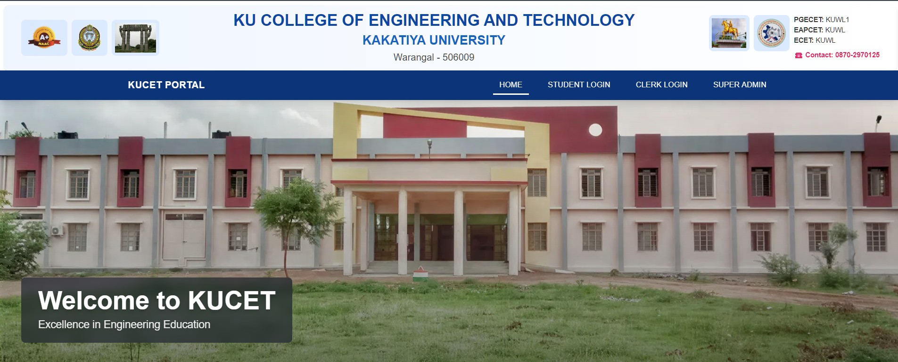
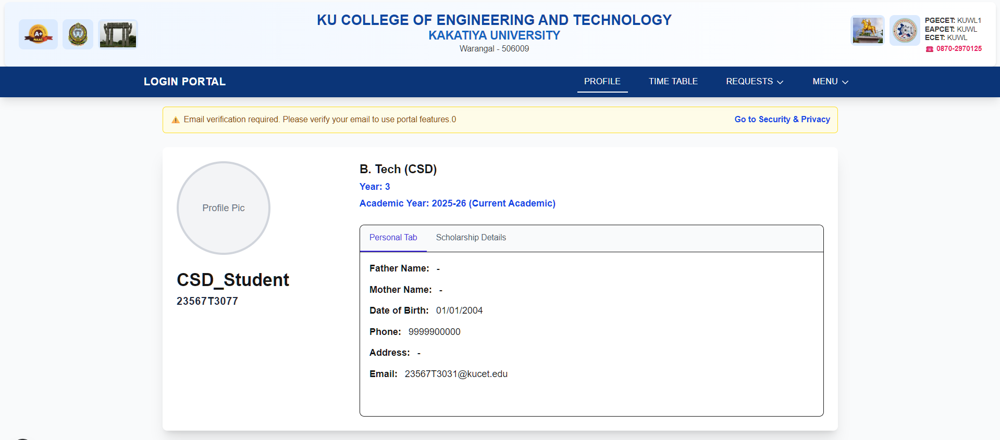
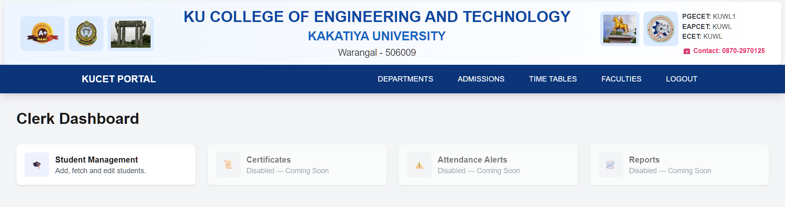
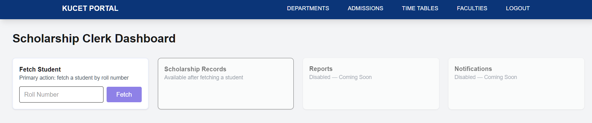

# KUCET College Management System

A role-based college management web application designed to digitalize
student administration, scholarships, and fee management workflows.

This system is being developed as a real-world institutional solution,
not just a demo project, with a strong focus on correctness, automation,
and role-based access.

---

## 🎯 Project Objective

To replace manual Excel-based student records with a centralized,
secure, and scalable web system where:

- Students can view their academic and fee details
- Clerks can manage admissions, scholarships, and fees
- Administration can monitor and approve critical changes

---

## 🧩 Core Features

### ✅ Automated Student Identification
- Student Roll Number is the single source of truth
- Branch, academic type (Regular/Lateral), and academic year
  are automatically derived from the roll number

### ✅ Role-Based Access Control
- Student
- Administrative Clerk
- Scholarship Clerk
- Principal (Admin)

Each role sees only what they are allowed to see and edit.

### ✅ Normalized Database Design
- Master tables for student identity
- Transaction tables for year-wise records
- Summary logic derived dynamically
- No duplicated or derived data stored unnecessarily

---

## 👥 Role-Based Workflow

### 🎓 Student
- Login using Roll Number
- View personal profile (read-only)
- View Fee Details (per academic year)
- View payment history
- View scholarship status (if applicable)

---

### 🧑‍💼 Administrative Clerk
- Add new student records
- Fetch students by Roll No / Admission No / Name
- Edit all student details except Roll Number
- View student status
- (Future) Issue certificates and manage attendance flags

---

### 💰 Scholarship Clerk
- Fetch student using Roll Number
- View verified student information
- Manage **year-wise scholarship records**
- System reports:
  - Scholar vs Non-Scholar automatically
- Enter fee particulars per year
- Track Pending / Success status
- System captures clerk signature automatically

---

### 🧑‍⚖️ Principal (Admin)
- View scholarship updates
- Audit changes made by clerks
- Approve sensitive modifications (future scope)

---

## 🧠 Smart Automation Highlights

- Academic Year is **derived**, not stored
- Fee amount is **auto-calculated** based on:
  - Branch (Self-Finance / Non-Self-Finance)
  - Scholarship status
- Clerk cannot override system rules
- All calculations are centralized in a shared finance module

---

## 🖥️ Tech Stack

- **Frontend**: Next.js (App Router), JavaScript
- **Backend**: Node.js (API Routes)
- **Database**: MySQL
- **Authentication**: JWT (role-based)
- **Styling**: CSS / Tailwind (as applicable)

---

## 📸 Screenshots
- ### Home Page:
    
- ### Student Dashboard:
    
- ### Administrative Clerk Dashboard:
    
    
- ### Scholarship Clerk Dashboard:
    

---

## 🚀 Future Enhancements

- Attendance & Internal Marks Management
- Certificate Generation (Bonafide, No Dues, TC)
- Principal Approval Workflows
- Reports & Analytics
- Notification System (Email / In-app)

---

## 📌 Status

🟡 **In Active Development**

This project is evolving module by module with real institutional workflows in mind.
